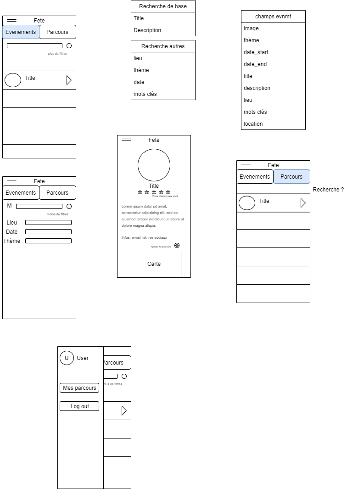

# Hackathon Fête de la science 2019

## Contexte

Création d’une application permettant d’exploiter les données OpenData de la Fête de la Science, et d’offrir des services en lien avec ces données.
Ce sont des données statiques, format libre.

## Fonctionnalités à réaliser

1. Exploration des événements via une Liste (avec filtrage) et une Map interactive
1. Affichage d’informations sur un événement
1. Intégration des fonctionnalités du terminal
1. Système de notation des événements par les utilisateurs
1. Création de parcours (suite d’événements) et leur publication
1. Système de mise à jour du taux de remplissage par des organisateurs

*Toutes les fonctionnalités ont été réalisées*

## Technologies utilisées

1. Flutter (Dart)
1. Github
1. NodeJs
1. Firebase

## Architecture

### Design

### Résultat

## Getting Started (flutter)

This project is a starting point for a Flutter application.

A few resources to get you started if this is your first Flutter project:

- [Lab: Write your first Flutter app](https://flutter.dev/docs/get-started/codelab)
- [Cookbook: Useful Flutter samples](https://flutter.dev/docs/cookbook)

For help getting started with Flutter, view our
[online documentation](https://flutter.dev/docs), which offers tutorials,
samples, guidance on mobile development, and a full API reference.
